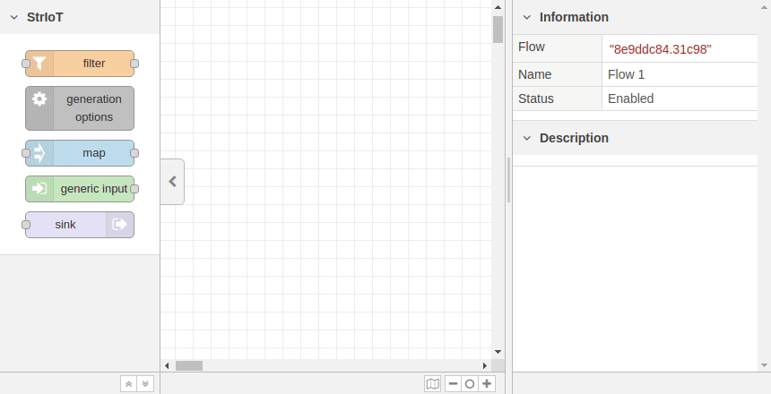

# Striot Nodes for Node-RED

This repository adds a number of new nodes to Node-RED, allowing the creation of Haskell-based stream processing programs, utilising the [StrIoT](https://github.com/striot/striot/) project, which is a Haskell-based pure functional stream processing system.

These nodes do not run within Node-RED, and instead Node-RED is simply used as a UI to build your stream-processing graphs. Once you have created your graph, you can use Node-RED to export it as a JSON file, which can then be use by the [StrIoT GUI](https://github.com/JonnySpruce/striot-gui) tool to generate the stream processing program.

**Features:**

- Adds a set of nodes to Node-RED enabling Haskell-based stream processing.
- Fully documented nodes with explanations for how to use them and example code.
- Easy export for use with the [StrIoT GUI](https://github.com/JonnySpruce/striot-gui) tool.

The nodes use user-defined Haskell code to manipulate data streams, which allows for flexible and powerful stream processing applications to be developed. See the **Nodes Added** section below for more information on the nodes which this repository adds to Node-RED.

## Getting Started

### Prerequisites

- [Node.js](https://nodejs.org/en/)
- [Node-RED](https://nodered.org/)
- Node-RED must have been run at least once using the `node-red` command in the terminal

Recommended:

- [StrIoT GUI](https://github.com/JonnySpruce/striot-gui) tool - generates a stream processing application from the Node-RED export using these nodes

### Installation

This package is not currently published on NPM or other package managers, so simply git clone this repository onto your system:

`$ git clone https://github.com/JonnySpruce/striot-nodes.git`

Then in your Node-RED directory, simply install the nodes by running:

`npm i /path/to/cloned/repository`

### Running

Start Node-RED from the terminal with the command `node-red`, and there will be a new section of nodes labelled **StrIoT**, where you will find all supported nodes for the [StrIoT](https://github.com/striot/striot/) system.

Simply drag and drop the nodes onto the canvas, and double click on a node to edit its properties and add code etc.

### Examples

There are also example flows in the [examples](examples) directory, which you can import into Node-RED to see how the flow is structured and the code is written. The files output by the [StrIoT GUI](https://github.com/JonnySpruce/striot-gui) tool are also included for each example, and can be run using the `docker-compose up` command in the directory of the example you want to run (**Note:** [Docker](https://www.docker.com/) must be installed).

### Exporting

From the Node-RED window, click the menu button in the top right corner, then **Export**, to view the export screen. Select the options you wish to use and then click **Download** to download the exported stream processing graph. You can then pass this JSON file to the [StrIoT GUI](https://github.com/JonnySpruce/striot-gui) program, which will automatically generate your program based on your Node-RED flow.

## Nodes Added

| Name               | Description                                                                                                         |
| ------------------ | ------------------------------------------------------------------------------------------------------------------- |
| Filter             | Filters streams based on a user-defined function.                                                                   |
| Generic Input      | Allows any user-defined function to be used as an input to the stream.                                              |
| Sink               | Allows any user-defined function to be used as an ouput to the stream.                                              |
| Map                | Maps values in the stream based on a user-defined function.                                                         |
| Generation Options | Allows definition of the generation options, including imports, packages, presource code and optimisation settings. |

## Contributing

All contributions are welcome! Any work on the issues raised in the [issue tracker](https://github.com/JonnySpruce/striot-nodes/issues) is always greatly appreciated. Alternatively, if you have a feature that you would like to add or a bug that you'd like to fix which isn't mentioned in the [issue tracker](https://github.com/JonnySpruce/striot-nodes/issues), feel free to [create a new issue](https://github.com/JonnySpruce/striot-gui/issues/new/choose) to discuss it.

For any pull request which adds new code, tests should also be included. All tests must pass before code can be merged.

## Bugs & Feature Requests

If you're having an issue with the tool or have a feature request to add, please feel free to raise an issue in the [issue tracker](https://github.com/JonnySpruce/striot-nodes/issues).
